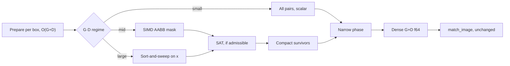
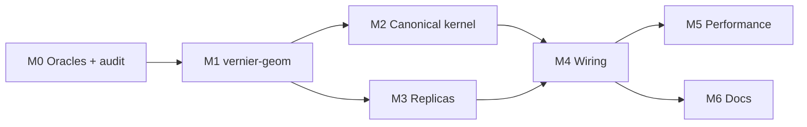

# ADR-0063: Oriented-box evaluation — `RotatedBox` and `Quad` kernels

- **Status:** proposed (M0 audit complete — see §"M0 findings"; two errata below)
- **Date:** 2026-09-19
- **Deciders:** @NoeFontana
- **Consulted:** —
- **Informed:** all contributors
- **Target:** next minor release
- **Amends:** ADR-0048 (the facade gains an unconditional `vernier::geom` re-export)
- **Related:** ADR-0002 (parity model), ADR-0003 (`pulp` dispatch), ADR-0004
  (numerical layout), ADR-0005 (`Similarity` trait and the spine lock),
  ADR-0008 (bbox f64 end-to-end), ADR-0011 (discriminated kernel config),
  ADR-0019 (result tables), ADR-0028 (`(quirk, oracle)` keying), ADR-0031
  (distributed partials), ADR-0036 (oracle vendoring pattern), ADR-0039
  (cross-paradigm parameterization conventions), ADR-0044 (LRP defaults),
  ADR-0046 (slicing, `retained_ious`), ADR-0047 (threading), ADR-0048
  (facade), ADR-0049 (bench CPU budget)

> **Numbering note.** This ADR was drafted as "ADR-0050". That number was
> taken by [ADR-0050 — parallelize `accumulate`](0050-parallel-accumulate.md)
> before the draft landed, so it ships as 0063. Open question 9 below is
> therefore resolved, not open: the assignment-axis ADR takes a later free
> number.

## Context and problem statement

The hard part of oriented-box evaluation is the contract, not the kernel.
`pycocotools` has no OBB path, so "bit-equal to the COCO API" has no
referent until this ADR names one.

vernier evaluates axis-aligned boxes, masks, boundaries and keypoints;
oriented boxes are missing. They are the standard output for aerial
imagery (DOTA), scene text and industrial picking. `hotcoco` already
ships OBB evaluation via polygon clipping, and `docs/comparison.md`
names that as a reason to pick `hotcoco`.

The ecosystem runs two unrelated kernels:

- **D2** — detectron2 `RotatedCOCOeval`. A `pycocotools` `COCOeval`
  subclass whose `computeIoU` calls `pairwise_iou_rotated`. f32, vertex
  collection plus Graham-scan hull, pair-midpoint center shift, degrees.
  Its output is not guaranteed to lie in `[0, 1]` (detectron2#350).
- **DK** — DOTA_devkit task1. VOC-style matching over `polyiou.iou_poly`.
  f64, arbitrary quadrilaterals, triangle-fan decomposition about the
  coordinate origin, no trigonometry.

They disagree at the bit level with each other and with exact geometry.
A third lineage, `mmcv` `box_iou_rotated` (mmrotate), shares D2's
algorithm but takes radians.

Three questions follow:

1. Which oracle does `strict` mean, per geometry?
2. Can the SIMD pipeline a fast kernel wants coexist with op-exact oracle
   replication?
3. Where does DOTA's headline metric (VOC-style mAP@0.5) fit, given that
   it changes the matching rule ADR-0005 locks?

## Decision drivers

- **Strict parity is the product.** Every `strict` claim names an
  `(oracle, commit, platform)` triple and is bit-equal against it. A claim
  we cannot make bit-exact is demoted to decision-equivalence, never
  asserted.
- **The ADR-0005 spine is untouchable.** `match_image` and `accumulate`
  see a dense f64 matrix and nothing else. Editing them is a new ADR, not
  a workaround.
- **One wheel, one behavior (ADR-0047).** Results are bit-identical across
  AVX2 / AVX-512 / NEON dispatch targets and across thread counts, in both
  parity modes.
- **Conventions are explicit.** Angle unit and rotation direction are the
  most common real-world OBB bug. Nothing is inferred or defaulted —
  ADR-0039's rule that a convention a user can get wrong is a required
  parameter, not a default.
- **Performance.** Beat `hotcoco`, detectron2 and DOTA_devkit on every
  ADR-0049 cell, at DOTA-v2 scale, single- and multi-threaded.
- **Reuse.** The geometry substrate must serve the planned 3D work: BEV
  IoU of yawed boxes is this rotated-box kernel times a z-interval
  overlap.
- **Agent-executable.** Every milestone has a mechanical exit gate, so
  `ready` can hand off to coding agents.

## Considered options

Seven independent axes. Letters avoid collision with the oracle keys
`D2` / `DK`.

**Axis P — Protocol scope**

1. **P1** COCO protocol only; oriented boxes are new kernels.
2. **P2** COCO protocol plus the DOTA/VOC protocol in this release.
3. **P3** A standalone `obb.dota_map()` oracle port beside the spine.

**Axis O — Strict oracle per geometry**

1. **O1** `RotatedBox` → D2, `Quad` → DK.
2. **O2** D2 for both; quads converted to rotated boxes.
3. **O3** DK for both; rotated boxes converted to quads.
4. **O4** No strict oracle; `corrected` mode only.

**Axis K — Kernel per parity mode**

1. **K1** `strict` runs an op-exact replica per oracle; `corrected` runs
   one canonical f64 kernel.
2. **K2** One kernel for both modes, as ADR-0008 chose for bbox.
3. **K3** Canonical kernel everywhere, with a tolerance claim in `strict`.

**Axis T — Threshold semantics under D2** (contingent on M0)

1. **T1** Evaluator substitutes the ladder `t' = f64(f32(t))` when the
   matrix is f32-valued.
2. **T2** The kernel projects IoU values onto the threshold lattice.
3. **T3** Accept the divergence.

**Axis F — Prefilter policy**

1. **F1** Admissibility-gated per oracle.
2. **F2** One prefilter for every mode; accept matrix divergence on
   disjoint pairs.

**Axis S — Python surface**

1. **S1** Two `IouKind` variants: `RotatedBox(unit, rotation)` and
   `Quad()`.
2. **S2** One variant `Obb(geometry, convention=None)` with conditional
   required fields.
3. **S3** One variant with a `reference="detectron2" | "dota"` knob.

**Axis G — Geometry placement**

1. **G1** New leaf crate `vernier-geom`.
2. **G2** Module inside `vernier-core::similarity`.

## Decision outcome

Chosen: **P1 + O1 + K1 + T1** (contingent on M0) **+ F1 + S1 + G1**.

- **P1.** VOC matching takes the argmax over all GTs and scores an FP if
  that GT is claimed; COCO falls back to the best unclaimed GT. A
  *difficult* argmax makes the detection ignored, and AP integrates over
  11 points or the all-point envelope. That is an assignment policy plus a
  summarizer, orthogonal to geometry, so it moves to the assignment ADR
  (COCO-greedy, VOC-argmax, Optimal) and brings axis-aligned Pascal VOC
  with it. P2 edits the locked spine inside a kernel ADR; P3 forks a
  second matching engine outside the firewall.
- **O1.** Each geometry's oracle is the community reference for that input
  type. O2 and O3 would put OpenCV `minAreaRect` — or someone's
  rbox→poly bits — inside the strict claim. O4 gives up the product.
- **K1.** ADR-0008 rejected a parity-mode kernel branch because the
  alternative only bought throughput. Here `corrected` has a correctness
  mandate: D2 emits IoU outside `[0, 1]` and runs geometry in f32; DK
  returns non-zero residues on disjoint pairs. K2 would make `corrected`
  inherit oracle defects; K3 abandons `strict`.
- **T1.** Spine and matrix stay untouched, and per-pair IoUs remain the
  oracle's values. T2 couples the kernel to the ladder and perturbs
  exposed IoUs; T3 knowingly ships a decision divergence in `strict`.
- **F1.** The only policy under which the matrix-level claim is true.
- **S1.** ADR-0011's rationale: parameterized variants and exhaustive
  `match` narrowing, no conditional required fields (S2), no knob whose
  meaning depends on the parity mode (S3). The variant selects the strict
  oracle.
- **G1.** The `vernier-mask` precedent: a standalone domain with its own
  oracles, fuzz targets and pinned constants. It also keeps replica ports
  quarantined and serves the 3D work.

### Consequences

- **Positive.** vernier gains an OBB `strict` claim against named, pinned
  oracles — the wedge `comparison.md` already sells, now applied where
  `hotcoco` currently wins.
- **Positive.** The ADR-0005 architectural test passes again: no edit to
  `matching.rs` or `accumulate.rs`.
- **Positive.** `vernier-geom` is the substrate for 3D BEV IoU. The shim's
  override honoring closes a latent correctness hole for *every*
  `COCOeval` subclass, not just OBB.
- **Negative.** Two replica kernels to maintain, each with a vendored
  oracle, and D2's with a flag-pinned C++ harness plus a bridge test.
  `torch` becomes a test-only dependency of the D2 oracle environment, as
  it already is for `mmsegmentation` (ADR-0036).
- **Negative.** D2 `strict` is keyed to `linux-x86_64` builds of the
  oracle. It may be demoted to decision-equivalence if hull ordering
  depends on libstdc++ `std::sort` internals (M0 go/no-go).
- **Negative.** K1 branches kernels on `ParityMode`, departing from
  ADR-0008's single-kernel choice. The departure is justified by
  correctness, not throughput, and this section records why.
- **Negative.** Two `KernelKind` discriminators, a `params_hash`
  extension, and a nightly exhaustive-angle job if M0 shows it is needed.
- **Neutral.** DOTA's headline VOC-style mAP is not reproducible until the
  protocol ADR lands. Users who need it stay on DOTA_devkit for one
  release; the DK kernel is already at parity when they move.
- **Neutral.** The dense-matrix floor and `retained_ious` memory at DOTA-v2
  scale are measured, not fixed, here.

## Oracles

| Key | Oracle | Kernel | Role | License |
| --- | --- | --- | --- | --- |
| `D2` | detectron2 `RotatedCOCOeval` → `pairwise_iou_rotated` | f32, hull, degrees | `strict` for `RotatedBox` | Apache-2.0 |
| `DK` | DOTA_devkit `polyiou.iou_poly` | f64 polygons | `strict` for `Quad` (kernel layer) | **none stated** — see erratum 1 |
| `MR` | `mmcv` `box_iou_rotated` | D2 lineage, radians | cross-check only | Apache-2.0 |
| `SH` | `shapely` / GEOS | robust f64 overlay | tolerance oracle for property tests | BSD / LGPL, test-only |

D2's bits are a function of its compiler flags: baseline x86-64 has no FMA
to contract into, while GCC on aarch64 fuses by default. The strict claim
is therefore keyed to `(D2, commit, linux-x86_64 build)`. We vendor
`box_iou_rotated_utils.h` into a standalone harness built with
release-equivalent flags, plus a bridge test asserting
harness ≡ installed detectron2 on a fixture sample. Rust never contracts
FMA implicitly; replica modules additionally ban `f32::mul_add` /
`f64::mul_add` via `clippy::disallowed_methods`.

## Parity composes

Let Φ be the spine (match, accumulate, summarize), already bit-exact
against `pycocotools` on arbitrary finite matrices. With `≡` meaning
bitwise equality after `−0.0 → +0.0` normalization:

```
M_V ≡ M_O  ∧  τ_V ≡ τ_O^eff   ⟹   Φ(M_V, τ_V) ≡ Φ_O(M_O, τ_O)
```

`τ^eff` is the ladder the oracle *effectively* compares against.
End-to-end strict parity thus reduces to **matrix bit-equality** — a pure
geometry problem, fuzzable without any COCO machinery — plus one
comparison-semantics check.

## Threshold ladder (T1)

D2's `computeIoU` returns a torch f32 tensor. `evaluateImg` then tests
`ious[dind, gind] < iou` with `iou = min(t, 1-1e-10)` and `t` an
`np.float64`. If torch treats that scalar (a `float` subclass) as weakly
typed, the test runs in f32 against `f32(t)`.

vernier widens exactly and compares in f64 against `t`. The two disagree
on `IoU₃₂ = f32(tₖ)` whenever `f32(tₖ) < tₖ`; at `t = 0.7`,
`f32(t) = 0.699999988…` and D2 matches where vernier does not. Density is
~2⁻²⁴ per threshold, but DOTA-v2 has millions of candidate pairs × 10
thresholds.

Under D2-strict, the `RotatedBox` evaluator entry hands `match_image` the
ladder `t'ₖ = f64(f32(tₖ))`. Widening `w` is exact and monotone, so:

```
x <₃₂ fl₃₂(t)   ⟺   w(x) <₆₄ w(fl₃₂(t)) = t'
```

`match_image` is unchanged in signature and code. Labels and
`params_hash` keep `t`. `f32(1 − 1e−10) = 1.0`, so the guard only matters
if `t = 1.0` is on the ladder. If M0 shows torch promotes to f64, T1 is
dropped and row **OB10** becomes `n/a`.

## Prefilter admissibility (F1)

```
F admissible for K  ⟺  ∀ (g,d): F(g,d) = reject  ⟹  bits(K(g,d)) = bits(+0.0)
```

- **DK.** The fan decomposition sums cancelling signed triangle areas, so
  HBB-overlapping but polygon-disjoint pairs can return a residue. The
  only admissible prefilter is the task1 script's own: HBB overlap with
  the VOC `+1`. The composed oracle is defined as "`polyiou` if
  HBB₊₁-overlap, else 0"; SAT is inadmissible here.
- **D2.** Evaluates every pair but returns exactly 0 once boxes are
  separated beyond the reach of its epsilon-inflated tests. A padded
  AABB/SAT with margin `δ ≥` that reach is admissible; M0 derives `δ` from
  the op trace.
- **Canonical.** Any sound prefilter. Slivers thinner than the margin are
  defined as 0 by construction.

A permanent fuzz property (10⁸ pairs biased toward near-contact) asserts
`reject ⟹ oracle ≡ +0.0` for each strict flavor.

## Geometry, conventions and numerics

IoU depends on exactly two convention parameters, unit `κ` and rotation
sign `σ`; both are required. The canonical kernel clips in the **GT's own
frame**, which removes image-coordinate magnitude from the error budget.

### Conventions

Pixel frame: `x` right, `y` down. A rotated box is center-based by
definition:

```
P(c, w, h, θ) = { c + R(σκθ)·(s·w/2, t·h/2)ᵀ : s, t ∈ [−1, 1] }
κ ∈ {1, π/180},  σ ∈ {+1, −1}
```

With `y` down, `σ = +1` turns `+x` toward `+y`, i.e. **clockwise on
screen** (`screen_cw`); `σ = −1` is `screen_ccw`. `P` is invariant under
`θ ↦ θ + π` and `(w, h, θ) ↦ (h, w, θ + π/2)`. `le90`, `le135`, `oc` and
OpenCV's 4.5.1 range change are therefore parameterizations of one
quotient, and IoU cannot depend on them.

The *parameterization* is not bit-invariant: D2 computes corners from
`(w, h, θ)`, so `(h, w, θ + 90)` moves last bits. `strict` passes user
numbers through untouched; only `corrected` canonicalizes. M0 pins D2's
`σ` with its documented probe: `(5, 3, 4, 2, 90)` must yield corners
`(4, 5), (4, 1), (6, 1), (6, 5)`.

### Canonical kernel (`corrected`), `RotatedBox`

1. **Prepare per box, once.** `c, w, h, θ` as given; `(cos, sin)` of
   `σκθ`; padded AABB; `A = w·h`. GTs are cached across cells like
   `SegmGtCache`.
2. **Relative translation.** `Δ = c_d − c_g` has error `≤ ε|Δ| ≤ εL`,
   exact by Sterbenz when coordinates are within a factor of 2. Forming
   corners in absolute coordinates first would cost `εX` per vertex
   instead.
3. **Relative rotation.** `φ = θ_d − θ_g`, evaluated with
   `sinpi`/`cospi`-style reduction for degree inputs so `k·90°` is exact.
   One trig pair per surviving pair; survivors are `O(G + D)`.
4. **`d` in `g`'s frame.** Corners are
   `R(−σκθ_g)Δ ± R(σκφ)(w_d/2, 0) ± R(σκφ)(0, h_d/2)`; every term is
   `O(L)`.
5. **Clip.** `g` is the box `[−w_g/2, w_g/2] × [−h_g/2, h_g/2]`, so
   Sutherland–Hodgman is four axis-aligned stages. For stage `x ≤ a` with
   `P` inside, `Q` outside: `s_P = P_x − a ≤ 0 < s_Q` and
   `t = s_P / (s_P − s_Q)`. The denominator is strictly negative by the
   classification itself, so no epsilon guard exists. The clipped
   coordinate is snapped to exactly `a`.
6. **Area and ratio.** Shoelace in `g`'s frame gives `I`, clamped to
   `[0, min(A_g, A_d)]`. `IoU = I / (A_g + A_d − I)`, or `I / A_d` for
   crowd GT (**E1**); clamped to `[0, 1]`; `U ≤ 0` gives `0` (**I3**
   analog).

Buffers are fixed stack arrays of 32 vertices. The fuzz suite records the
maximum vertex count (8 expected for rectangle ∩ rectangle) and fails
above 12.

**Exact properties.** `IoU(a, a) ≡ 1.0`: `Δ = 0` and `φ = 0` give corners
exactly `(±w/2, ±h/2)`, every shoelace term is `2·fl(wh/4)`, and the sum
is `fl(wh) = A`. With degree inputs, `θ_g ≡ θ_d mod 90°` makes `d` exactly
axis-aligned in `g`'s frame. Pairs separated beyond the margin return
`+0.0`.

**Error bound.** With `L` the longest side in the pair and `r` the aspect
ratio of the box carrying it, `U ≥ L²/r` and `∂IoU/∂I ≤ 2/U`:

```
|ΔIoU| ≤ (2/U)·|ΔI| ≤ (2r/L²)·c₂·ε·L² = 2·c₂·ε·r
```

At `ε = 2⁻⁵³` and `r = 10³` that is ~`10⁻¹³·c₂`, independent of image
size. By contrast, an f32 absolute-frame shoelace at DOTA-scale
`X = 2·10⁴` rounds each term by up to `u₃₂X² ≈ 24 px²`, comparable to a
small vehicle's whole area. D2's midpoint shift exists for exactly this;
DK survives by being f64.

**Rejected: Green's theorem with Cyrus–Beck edge clipping.** It is
branchless with fixed trip counts, ideal for SIMD. But near-coincident
edges (perfect-DT copies, parked cars sharing edges) get classified twice,
as "`e ⊂ Q`" and "`f ⊂ P`". If rounding says yes to both, a cross term of
magnitude `L²` is double-counted — an `O(1)` IoU error.
Sutherland–Hodgman applies each half-plane once to one evolving polygon,
so misclassification costs `O(εL²)`.

### Quads

DOTA GT quads are neither rectangles nor guaranteed convex.

- **Ingestion.** Orient CCW by signed area. Zero-area quads raise a typed
  error in both modes (**OB7**). Self-intersecting quads raise a typed
  error in `corrected`.
- **Convex split.** A simple quad has at most one reflex vertex, and the
  diagonal from it is interior. Non-convex quads split into two triangles.
- **Kernel.** Translate to `g`'s centroid (same magnitude argument as step
  2), then clip each convex piece of `d` against each convex piece of `g`
  with general half-planes: at most 4 clips, summed.
- **Strict.** The DK replica consumes the quads exactly as given, vertex
  order included.

Non-finite coordinates raise `NonFiniteError` at ingestion in every mode.
`w ≤ 0` or `h ≤ 0` gives `A = 0` and `IoU = 0`.

## Kernel pipeline and performance

At DOTA scale the `O(G·D)` terms dominate, not the polygon clip.
Engineering effort goes to the broad phase and the dense-matrix floor; the
narrow phase stays scalar until a profile says otherwise.

### Cost model

Per `(image, category)` cell with `G` GTs, `D` detections and `K`
surviving pairs:

```
T_cell ≈ G·D·(c_bp + c_mem) + K·c_np + T_match
K = O(G + D),   T_match = O(T·G·D)
```

`c_bp` is the broad phase per pair and `c_mem` the dense-matrix write. In
real scenes each box overlaps `O(1)` neighbours, so `K ≪ G·D` and `c_np`
is the asymptotically cheap term.

### Pipeline



Regime thresholds (`SMALL_CELL_THRESHOLD_OBB`, `T_SAP`, `T_SPLIT`) are
named constants measured from the Stage-0 histogram on DOTA-v1 and
DOTA-v2 val, as `SMALL_CELL_THRESHOLD` was for bbox.

| Stage | D2-strict | DK-strict | `corrected` |
| --- | --- | --- | --- |
| Prefilter | Padded AABB and SAT, margin `δ` from M0 | HBB overlap with VOC `+1`, nothing else | AABB and SAT |
| Narrow phase | Scalar D2 replica | Scalar DK replica | Scalar canonical; vertical SIMD gated |
| Rejected pairs | `+0.0` | `+0.0` | `+0.0` |
| Matrix values | f32, widened; ladder `t'` | f64 | f64 |

- **Broad phase.** The mid regime reuses the
  `BboxIou::compute_overlap_mask` kernel on enclosing HBBs — the **I1**
  pattern segm already uses; DK-strict takes a `+1` variant. Its zero
  writes double as matrix initialization, so `c_mem` is paid once.
- **SAT.** Pays off for thin diagonal objects (ships at berth), where the
  HBBs of 45° boxes overlap heavily. In `g`'s frame it is "HBB of `d`
  against `g`'s extents".
- **SIMD policy.** Vectorize *across pairs*, never within one pair's
  reduction. Each lane executes the scalar op sequence with no FMA and no
  reassociation, so AVX2, AVX-512 and NEON variants are bit-identical to
  scalar in both modes.
- **Vertical SIMD narrow phase.** Built only if the narrow phase exceeds
  30% of OBB kernel wall time on DOTA-v2 val. Design: fixed-slot
  Sutherland–Hodgman with validity masks and forward-filled invalid slots,
  which is scatter-free. Duplicate consecutive vertices contribute exactly
  0 to the shoelace, since `xᵢyᵢ − xᵢyᵢ ≡ 0`.
- **Replicas stay scalar.** D2's hull sort and DK's 16 triangle-pair cuts
  are data-dependent control flow. They are fast only because the
  admissible prefilter keeps `K` small.
- **Parallelism.** Per-cell rayon as today (ADR-0047), plus row-block
  splitting of the *kernel*, never of `match_image`, for `G·D ≥ T_SPLIT`.
  DOTA cell sizes are heavy-tailed; each matrix entry is a pure function
  of its pair, so splitting is deterministic.

### The spine floor

Two costs survive any kernel work, and neither is fixed here.

**Dense matrix memory.** A 2000 × 2000 cell is 32 MB of f64 before any
geometry. ADR-0046's `retained_ious` store keeps these matrices alive for
partitioned LRP, so at DOTA-v2 scale it sets the memory ceiling. Only a
spine ADR can go sparse; M5 records the DOTA-v2 cell-size histogram as
evidence for or against writing it.

**Matching scans.** `matching.rs` visits every GT for every DT at every
threshold. A signature-preserving change is bit-exact: iterate per-row
candidate lists `{g : iou ≥ c}` in ascending sorted-GT order, with
`c = minₖ min(tₖ, 1 − IOU_BOUNDARY_EPS)`.

1. `best` is seeded at `min(t, 1 − IOU_BOUNDARY_EPS) ≥ c` (**B1**) and
   only rises, so every non-candidate hits `continue` in the dense loop.
2. Once `m` is a non-ignore match, no ignore GT can update `m` in either
   loop: each one hits the matched-GT `continue` or the **B3** `break`.
   **A4** sorts ignore GTs last, so skipping non-candidates cannot reorder
   that tail.
3. Before that point, skipped entries only ever `continue`.
4. The argument needs finite entries: `NaN < best` is false, so the dense
   loop would select a NaN. The kernel contract already forbids NaN.

This ships as a separate performance PR benefiting every kernel, gated by
a property test comparing dense and candidate loops on random matrices
with ties, crowd and ignore GTs.

## Public surfaces

Two `IouKind` variants, two FFI entries, one leaf crate, and a hardened
shim. The shim change matters most: today a detectron2 `RotatedCOCOeval`
run under `patch_pycocotools()` can silently compute the wrong IoU.

### Crate: `vernier-geom`

A leaf crate, `#![forbid(unsafe_code)]`, depending on nothing but `pulp`
and `thiserror` (erratum 2).
It claims its name at its first real release, per the no-reservation rule
(ADR-0048).

- `convention` — `AngleUnit`, `Rotation`, rbox → quad (`corrected` bits).
- `prepared` — per-box prepared geometry and padded AABBs.
- `clip` — canonical Sutherland–Hodgman (axis-aligned and general
  half-planes) and shoelace.
- `quad` — orientation, convexity, split, validation.
- `replica::{d2, dk}` — op-exact ports. `clippy::disallowed_methods` bans
  `mul_add`; each file cites its upstream file and commit.
- `pinned` — oracle constants with source citations, plus a drift tripwire
  against `VENDORING.md`, as in `vernier-semantic/src/parity.rs`.
- `calipers` — minimum-area enclosing rectangle, for the label-ceiling
  diagnostic. Explicitly not a parity surface.

The facade adds `pub use vernier_geom as geom;` unconditionally, like
`mask`. It is not a feature: it changes what is *nameable*, never what is
*computed* (ADR-0048 invariant).

### Core wiring

- `similarity/obb.rs` defines `RotatedBoxIou { unit, rotation, flavor }`
  and `QuadIou { flavor }`, both `Similarity + EvalKernel`.
  `flavor ∈ {D2Replica, DkReplica, Canonical}` is fixed at construction
  from `ParityMode`.
- Annotation types `RotatedBoxAnn` / `QuadAnn` carry prepared geometry,
  `is_crowd` and `ann_id`. `ObbGtCache` mirrors `SegmGtCache`.
- `KernelKind` appends `RotatedBox = 4` and `Quad = 5`, one per Python
  variant as for the existing four. Unit and rotation enter `params_hash`,
  so `from_partials` refuses to merge incompatible partials. M4 verifies
  pre-OBB readers reject discriminants 4 and 5 through checked archive
  access.
- `bench-histogram` gains `ObbBroad` and `ObbNarrow` record kinds.

### Dataset model

- `CocoAnnotation`, `CocoDetection` and `DetectionInput` gain
  `rbox: Option<[f64; 5]>` and `quad: Option<[f64; 8]>`. Under an OBB
  kernel the matching field is required; otherwise `InvalidAnnotationError`
  names the ids.
- DT area for rboxes is `w·h`. That equals `pycocotools` `loadRes`'s
  `bb[2]*bb[3]` on a len-5 `bbox`, so **J3** transfers verbatim. Quad area
  is `|shoelace|` with a pinned formula.
- A GT `bbox` absent from JSON is derived from geometry as the tight
  envelope (`corrected` row). `strict` trusts the GT `area` field, as
  `pycocotools` does.
- Arrow ingestion takes `rbox` as `fixed_size_list<f64, 5>` and `quad` as
  `fixed_size_list<f64, 8>`.

### The len-5 `bbox` and the compat shim

detectron2 stores rotated boxes as `bbox = [cx, cy, w, h, a]`.
`patch_pycocotools()` rebinds `pycocotools.cocoeval.COCOeval` to
`PycocotoolsCOCOeval`, and `docs/migrate/from-pycocotools.md` recommends
exactly that for detectron2 test suites. `RotatedCOCOeval` then subclasses
the shim, and its Python `computeIoU` override is dead code on the Rust
path.

1. **Ingress audit (M4).** `serde`'s `[f64; 4]` must hard-fail on len-5,
   and the Python-dict, Arrow and shim paths must too. A len-5 `bbox` read
   as `[x, y, w, h]` is this release's worst failure mode.
2. **Len-5 on the shim only.** Accepted as D2 `XYWHA` (degrees, D2's `σ`)
   and routed to `RotatedBox` `strict`. The native surface requires
   `rbox`.
3. **Override honoring.** If a subclass defines its own `computeIoU`, the
   shim calls it per `(image, category)` cell with `pycocotools`' DT
   ordering and `maxDets[-1]` truncation. It then transposes the `[D, G]`
   result to f64 `[G, D]` and runs the Rust spine; an f32 result triggers
   T1's ladder. `RotatedCOCOeval` becomes bit-exact by construction, using
   D2's own kernel, and the same latent hazard closes for every subclass.
   This requires `pycocotools`-shaped `_gts`, `_dts` and `params` on the
   shim; M4 audits that.

### Python

```python
@dataclass(frozen=True, slots=True)
class RotatedBox:
    """Center-based rotated box (cx, cy, w, h, θ). Strict oracle: detectron2 (D2)."""
    unit: Literal["deg", "rad"]                   # κ — required, no default
    rotation: Literal["screen_cw", "screen_ccw"]  # σ = +1 / −1; pixel frame, y down


@dataclass(frozen=True, slots=True)
class Quad:
    """Four vertices, any order or orientation. Strict oracle: DOTA_devkit (DK)."""


IouKind = Bbox | Segm | Boundary | Keypoints | RotatedBox | Quad

evaluator = Evaluator(iou=RotatedBox(unit="deg", rotation="screen_ccw"), parity_mode="strict")
```

The variant selects the strict oracle; there is no `reference=` knob.
`vernier.instance.obb.to_quad` converts rboxes with `corrected`-mode bits;
for DK-strict, pass the quads you would actually submit.

### FFI and CLI

- FFI per ADR-0011, each signature carrying exactly its kernel's
  parameters: `evaluate_rotated_box_summary(..., unit, rotation)` and
  `evaluate_quad_summary(...)`. `_core.pyi`, the stub conformance test and
  `pyright --verifytypes` stay green.
- CLI: `vernier eval --iou rotated-box --angle-unit deg --rotation
  screen-ccw` and `--iou quad`. The ADR-0015 JSON schema stays `v1`; no
  new `Breakdown` is emitted.

### Tables (ADR-0019)

`per_pair` gains `angle_err_deg` for `RotatedBox` cells. It uses long-axis
directions, `ℓ(b) = θ if w ≥ h else θ + π/2` after applying `κ` and `σ`,
so it is invariant to the angle parameterization:

```
e = min over k ∈ ℤ of | ℓ(d) − ℓ(g) − k·m |

m = π/2  if  min over b ∈ {g,d} of |w_b − h_b| / max(w_b, h_b) < τ
m = π    otherwise
```

The near-square tolerance `τ` is an open question (proposed `0.05`).

### Diagnostics (`vernier.instance.obb`)

1. `convention_check(gt, dt)` computes AP@0.5 under the four `(κ, σ)`
   hypotheses on a sample. It *warns*, never auto-switches, when an
   undeclared hypothesis wins by a margin.
2. `label_ceiling(gt_quads)` reports per-class `IoU(quad,
   minAreaRect(quad))`: what rbox training labels lose on non-rectangular
   GT before the model does anything. vernier's own rotating-calipers
   rectangle, documented as *not* OpenCV-bit-equal.
3. HBB-vs-OBB comparison ("is the rotated head buying anything?") is a
   docs recipe using `Bbox()` on enclosing boxes, not a new surface.

LRP / oLRP, calibration and ADR-0046 slicing are kernel-agnostic and ship
unchanged. TIDE ships with ADR-0044-style tentative defaults (0.5 by
extrapolation).

## M0 findings and errata

M0 ran. Three of the blocking questions below are answered, one erratum
corrects a licensing claim, and one records a defect the draft did not
anticipate. Everything in this section is evidence, not intention; the
citations point into the pinned sources and the tests that check them.

### Erratum 1 — DOTA_devkit carries **no license**

The oracle table above recorded `DK` as MIT. That is wrong. DOTA_devkit
has no `LICENSE` file, no license header in any source file, no license
statement in `readme.md` or `setup.py`, and the GitHub API reports
`"license": null`.

With no grant there is no right to redistribute, so **PR-0.1 as drafted
cannot be executed**: vendoring the bytes is not available. The shipped
shape is instead the repository's existing developer-provisioned-cache
pattern — pin the SHA-256 of each file at a fixed commit, fetch on
demand into the git-ignored dev cache, skip cleanly when absent. The
parity claim is unaffected: reading a public source to reproduce its
observable behavior is not redistribution, and the hashes are what make
the replica's description of the algorithm checkable.

`tests/python/parity_obb/oracle/VENDORING.md` records the position in
full, including what happens if the commit becomes unreachable (the
`Quad` strict claim is demoted by a superseding ADR rather than
quietly retained).

### Erratum 2 — `vernier-geom` depends on `thiserror` too

§"Crate: `vernier-geom`" says the crate depends on "nothing but `pulp`".
It also depends on `thiserror`, as `vernier-mask` does and for the same
reason: the typed errors in **OB7** and **OB16** are part of the public
contract. `pulp` remains the only *compute* dependency.

### Finding 1 — D2 strict is a **go** (open question 1)

The draft's worst case was that `convex_hull_graham` feeds an
epsilon-based comparator to `std::sort`, which is not a strict weak
ordering, making the output depend on libstdc++'s introsort internals
for small `n`. It does not. **The `std::sort` call is commented out
upstream** (`box_iou_rotated_utils.h:228-240`); both the CPU and CUDA
paths run the same hand-written `O(n^2)` exchange sort
(`:242-256`), fully specified by its own source.

There is no standard-library ordering dependency and no libstdc++
version to pin. The claim remains keyed to the `linux-x86_64` build for
the FMA reason in §"Oracles", which is a compiler-flag question rather
than a library-internals one — and `build.sh` pins those flags.

**Verified:** `crates/vernier-geom/tests/d2_bridge.rs` runs 2 x 10^7
pairs across five adversarial regimes against the pinned header compiled
with release-equivalent flags. Zero divergences.

### Finding 2 — T1 ships (open question 2)

`computeIoU` returns a torch tensor
(`rotated_coco_evaluation.py:95`), not a numpy array. Probed on torch
2.11: a 0-d f32 tensor compared against `np.float64(0.7)` evaluates
**in f32** — the scalar is weak-typed and rounds to `f32(0.7)`. So
detectron2 matches at `IoU = 0.699999988...` where a faithful f64
comparison does not, exactly as axis T1 predicted. **T1 ships.**

One refinement to the guard: the draft worried about `t = 1.0`, where
vernier's internal `min(t', 1 - IOU_BOUNDARY_EPS)` and the oracle's
`f32(min(t, 1 - 1e-10))` differ. The divergence set is **empty** — the
largest f32 below 1 is `0.99999994`, so no f32 value lies in
`[1 - 1e-10, 1.0)` — and the composition needs no special case.
`parity::obb_ladder_tests` pins that.

### Finding 3 — the trig path is f64-then-narrow (open question 3)

`box_iou_rotated_utils.h:62-65`:

```cpp
// M_PI / 180. == 0.01745329251
double theta = box.a * 0.01745329251;
T cosTheta2 = (T)cos(theta) * 0.5f;
```

The comment is wrong: the literal is a 12-digit truncation of `pi/180`,
short by about `9.94e-12`. `cos` and `sin` run in **f64** and are then
narrowed to f32. Both facts are load-bearing and both are pinned in
`crates/vernier-geom/src/pinned.rs`. PR-3.3's exhaustive-angle job is
therefore in scope; the bridge test's exact-quadrant regime covers the
cases that matter most in the meantime.

### Finding 4 — *(new)* DOTA_devkit reads uninitialized memory

`polyiou.cpp:63-64` writes `lineCross(a, b, p[i], p[i+1], pp[m++])`.
The post-increment fires whether or not `lineCross` wrote anything, and
`lineCross` returns without writing on its parallel (`:36`) and
fully-degenerate (`:35`) paths. The slot then holds stack garbage.

This is undefined behavior in the oracle, so `strict` has no bits to
reproduce. The replica models it as faithfully as a defined program can
— one `pp` buffer per triangle-pair call, reused across the three cuts
exactly as the upstream stack array is, with a first-touch slot reading
`(0, 0)` — and counts how often the path fires so a fuzz run reports it
rather than assuming it never happens.

Reaching it needs two cross products within `1e-8` of zero on opposite
sides. On integer-coordinate polygons, which is what DOTA annotations
are, the cross products are exact integers and a sign change forces a
gap of at least 1, so the path is unreachable. Both bridge runs report
zero occurrences. Filed as quirk **OB19**.

### Finding 5 — *(new)* convention translation under `strict`

The D2 replica speaks one dialect: degrees, screen-CCW. `screen_cw`
input reaches it through an exact negation, so nothing is lost.
`unit="rad"` needs a `180/pi` scaling that **rounds**, so the pinned
bit-equality claim is keyed to `unit="deg"`; radians are
decision-equivalence. Filed as quirk **OB20**.

### Corrections from the M4 review

A numerics review after M4 found four defects in the wiring, all fixed
in the same pass. They are recorded here because three of them are
statements this ADR makes that the code did not keep:

1. **The T1 projection reached only two of the paths that run the D2
   replica.** It lived on `evaluate_rotated_box` and
   `evaluate_rotated_box_parallel`, so the generic funnel, the LRP
   decompose pass and the partitioned entry points compared an
   f32-valued matrix against an unprojected f64 threshold. It now hangs
   off `EvalKernel::project_thresholds` and is applied by
   `evaluate_with` / `evaluate_with_parallel`, with `LrpParams`'s
   `tp_threshold` projected in the LRP entry points — LRP compares the
   retained matrices against it directly, which the ladder projection
   does not reach. The report's label keeps the declared threshold; the
   comparison uses the projected one. The normalizer moves with the
   comparison, without which `oLRP_Loc` could exceed 1.
2. **OB13 was documented but not wired.** Every oriented entry point
   derived the DT area from the axis-aligned envelope, so `AP_small` /
   `AP_medium` / `AP_large` disagreed with the kernel that produced the
   IoUs. `DetectionArea::Oriented` now derives it from the geometry and
   is the default on every oriented surface.
3. **The prefilter was inadmissible for a box with both sides
   negative.** detectron2's `area = w * h` guard passes such a box and
   scores it; vernier's envelope collapsed to a point and rejected every
   pair it was in — a bit-inequality in the mode whose contract is
   bit-equality. `aabb_half_extents` and the SAT radii now take `|w|`
   and `|h|`.
4. **The bridge tests could not fail.** Both reported a skip and passed
   with no harness, and no lane set the variable that builds one, so the
   M3 exit gate was asserted by prose. `just test-obb-parity` and a CI
   job now run the D2 bridge with `VERNIER_OBB_REQUIRE_BRIDGE=1`, under
   which a missing harness is a failure. The DK bridge stays
   developer-provisioned; see `docs/engineering/obb-quirks.md`.

The same pass took the broad phase off the "written but unreachable"
list: `aabb_overlap_mask` had no caller, so the quadratic term ran
scalar. Both rotated-box flavors now route through it, with the
detection envelopes transposed into structure-of-arrays form and the
per-pair `reach` replaced by a cell-level bound
(`replica::d2::ReachBound`).

### Scope notes from M4

Four surfaces are deliberately not wired in this pass, each because
wiring it would have meant guessing rather than deciding:

- **The columnar `Detections(boxes=...)` ingest route** rejects the
  oriented kernels with a message naming the two routes that do carry
  oriented geometry. Its `boxes` column is `(N, 4)`; an oriented column
  is a new columnar surface, not a widening.
- **Streaming and background evaluation** raise `NotImplementedError`.
  The streaming evaluator keeps a per-kernel state machine on the Rust
  side that the oriented kernels are not part of yet.
- **`bbox` remains required** on every record. The ADR says a missing
  GT `bbox` is derived from geometry as the tight envelope; deriving it
  inside `serde` means a cross-field `try_from` on three widely-used
  structs, so for now the envelope is filled at the Python and CLI
  ingest layers and the Rust structs are unchanged. The columnar GT
  route (`Dataset.from_arrays`) has no `rbox` / `quad` column either,
  and **refuses** one rather than dropping it, so a caller who supplies
  oriented geometry there is told immediately instead of meeting a
  "GT has no `rbox` field" error much later.
- **PR-4.6's `per_pair` column.** `angle_error_deg` ships as a
  standalone diagnostic (`vernier.instance.obb.angle_error_deg`); the
  `angle_err_deg` column on the ADR-0019 `per_pair` table is not built,
  and `tables.rs` is unchanged.

## Implementation plan

Seven milestones; M0 writes no production code and gates `ready`. M2 and
M3 run in parallel after M1; every milestone ends on a mechanical gate.



### M0 — Oracle vendoring and op-trace audit

- **PR-0.1**: vendor DK (`polyiou` C++/SWIG and the task1 script) under
  `tests/python/parity_obb/oracle/dota_devkit/`, with `VENDORING.md`
  recording commit, per-file SHA-256 and license.
- **PR-0.2**: vendor D2 as a standalone harness of
  `box_iou_rotated_utils.h` with release-equivalent flags. Add
  `rotated_coco_evaluation.py` standalone over `pycocotools` with
  test-only `torch`, and a bridge test: harness ≡ installed detectron2 on
  10⁵ pairs.
- **PR-0.3**: MR harness, cross-check only.
- **PR-0.4**: `docs/engineering/obb-quirks.md` fully dispositioned with
  `file:line` citations. Includes the `σ` probe (**OB2**), the torch
  comparison-dtype probe (**OB10**), the D2 margin `δ`, and the D2
  hull-order go/no-go.

**Exit gate:** every seed row confirmed or refuted with a citation; open
questions resolved; ADR moves to `ready`.

### M1 — `vernier-geom` foundations

- **PR-1.1**: crate skeleton, conventions, prepared geometry, `pinned`
  with its drift tripwire.
- **PR-1.2**: quad validation — orientation, convexity, split,
  self-intersection and zero-area errors.
- **PR-1.3**: rbox → quad.

**Exit gate:** unit and proptest suites green; the `σ` probe fixture
reproduces D2's documented corners for `(5, 3, 4, 2, 90)`.

### M2 — Canonical kernel, scalar

- **PR-2.1**: axis-aligned Sutherland–Hodgman in `g`'s frame for rbox
  pairs.
- **PR-2.2**: general half-plane path for quads, including non-convex
  splits.

**Exit gate:** 10⁸ fuzzed pairs within `|ΔIoU| ≤ 1e−12` of `shapely` for
`r ≤ 10³`. `IoU(a, a) ≡ 1.0`; margin-separated pairs `≡ +0.0`; max vertex
count `≤ 12`. `θ ≡ 0 mod 90°` pairs lie within 2 ULP of `BboxIou` on the
equivalent HBBs.

### M3 — Replica kernels

- **PR-3.1**: DK replica plus its HBB₊₁ prefilter.
- **PR-3.2**: D2 replica, including trig path, midpoint shift and hull.
- **PR-3.3**: nightly exhaustive 2³² angle job, only if **OB4** shows f64
  trig cast to f32.

**Exit gate:** matrix bit-equality (mod ±0) on 10⁸ fuzzed pairs and on
every pair of DOTA-v1 val; admissibility fuzz green for both flavors.

### M4 — Wiring

- **PR-4.1**: `KernelKind` variants, `params_hash`, wire-format tests.
- **PR-4.2**: dataset fields, `serde`, Arrow, derivations; ingress audit
  making len-5 `bbox` hard-fail on every native path.
- **PR-4.3**: `EvalKernel` impls, the T1 ladder, FFI entries, `_core.pyi`.
- **PR-4.4**: Python variants and CLI flags.
- **PR-4.5**: shim len-5 routing and override honoring.
- **PR-4.6**: `angle_err_deg` and the diagnostics module.

**Exit gate:** end-to-end strict bit-equality against D2 `RotatedCOCOeval`
on DOTA-v1 val, with quad GT converted once via OpenCV and frozen so
OpenCV never enters the claim. Also against `COCOeval ∘ polyiou` on quad
GT. Thread counts `{1, 2, 8}` bit-identical; `from_partials` round-trips
and refuses mismatched kinds; stub conformance and `verifytypes` at 100%.

### M5 — Performance

- **PR-5.1**: Stage-0 histogram for OBB; measure and pin
  `SMALL_CELL_THRESHOLD_OBB`, `T_SAP`, `T_SPLIT`.
- **PR-5.2**: broad phase — overlap-mask reuse, SAT, sort-and-sweep.
- **PR-5.3**: intra-cell row-block splitting.
- **PR-5.4**: candidate-list matching (separate PR, benefits every
  kernel).
- **PR-5.5**: vertical SIMD narrow phase, only if the 30% trigger fires.

**Exit gate:** on the ADR-0049 cells (DOTA-v1 val, DOTA-v2 val, synthetic
dense `G = D = 2000`, COCO-like sparse), vernier's wall time is at or
below every competitor's at 1 and 8 threads. Strict gates unchanged.

### M6 — Docs

`migrate/detectron2-rotated.md`, `migrate/dota-devkit.md` (kernel parity
now, protocol pending), `explanation/obb-conventions.md`,
`comparison.md`, `CHANGELOG`.

## Test matrix

| Property | Canonical | D2 replica | DK replica |
| --- | --- | --- | --- |
| Matrix vs reference | `≤ 1e−12` vs `shapely` | bit-equal (mod ±0) | bit-equal (mod ±0) |
| Reject ⟹ `+0.0` | by construction | fuzz, margin `δ` | fuzz, HBB₊₁ |
| `IoU(a, a)` | `≡ 1.0` | oracle value | oracle value |
| Dispatch targets and thread counts | bit-identical | bit-identical | bit-identical |
| End-to-end | tolerance vs D2 and DK | bit-equal vs `RotatedCOCOeval` | bit-equal vs `COCOeval ∘ polyiou` |

**Data policy.** DOTA's license restricts redistribution, so real-data
parity runs against a developer-provisioned cache, as for COCO val.
Predictions come from a pinned public `mmrotate` checkpoint, cached like
the DETR cell.

## Open questions blocking `ready`

Items 1–3 are resolved by M0 evidence; items 4–10 are design calls for the
deciders.

1. **D2 strict go/no-go.** If D2's hull comparator is epsilon-based, it is
   not a strict weak ordering, and `std::sort` output depends on libstdc++
   introsort internals for `n ≤ 24` points. Port that path and pin a
   libstdc++ version, or demote D2 to decision-equivalence (identical
   `dtMatches` on DOTA-v1 val)?
2. ~~**T1 applicability.**~~ **Resolved: f32, so T1 ships.** See
   §"M0 findings", finding 2.
3. ~~**Trig path.**~~ **Resolved: f64, cast to f32**, on a truncated
   `pi/180` literal. PR-3.3 is in scope. See §"M0 findings", finding 3.
4. **JSON field names.** `rbox` / `quad`, and whether to accept `poly` as
   an alias for `quad`.
5. **`KernelKind` granularity.** Two discriminators (proposed) or one
   `Obb` with geometry in `params_hash`.
6. **Crate placement.** `vernier-geom` leaf (proposed) or a module in
   core.
7. **`per_pair` schema.** A kernel-specific `angle_err_deg` column or a
   nullable column across kernels; near-square tolerance `τ` (proposed
   `0.05`).
8. **Shim override honoring.** On by default with a one-time warning
   (proposed), or opt-in.
9. **ADR number.** ~~0050~~ **Resolved: 0063.** 0050 was taken by
   "Parallelize `accumulate`" before this draft landed. The assignment-axis
   ADR, which absorbs the VOC/DOTA protocol either way, takes a later free
   number.
10. **SAT under D2-strict.** Worth deriving `δ` for, or run D2-strict on
    padded AABB only.

## Links and references

**vernier ADRs.** ADR-0002 (parity model), ADR-0003 (`pulp` dispatch),
ADR-0004 (numerical layout), ADR-0005 (`Similarity` trait and spine lock),
ADR-0008 (bbox f64 end-to-end), ADR-0011 (discriminated kernel config),
ADR-0019 (result tables), ADR-0028 (`(quirk, oracle)` keying), ADR-0031
(distributed partials), ADR-0036 (oracle vendoring pattern), ADR-0039
(cross-paradigm parameterization), ADR-0044 (LRP defaults), ADR-0046
(slicing, `retained_ious`), ADR-0047 (threading), ADR-0048 (facade),
ADR-0049 (bench CPU budget).

**vernier docs.** `docs/comparison.md`,
`docs/migrate/from-pycocotools.md`,
`docs/engineering/pycocotools-quirks.md`,
`docs/engineering/sem-seg-quirks.md`, `docs/engineering/vendoring.md`.

**External.**

- detectron2 `box_iou_rotated_utils.h` — D2 kernel: midpoint shift, Graham
  hull.
- detectron2#350 — rotated IoU outside `[0, 1]`.
- detectron2 `structures` docs — `(x, y, w, h, angle)` convention and the
  `(5, 3, 4, 2, 90)` worked example.
- DOTA_devkit `dota_evaluation_task1.py` — DK protocol and the
  `polyiou.iou_poly` call site.
- `hotcoco` — competing Rust implementation with OBB via polygon clipping.

## Appendix — seed of `docs/engineering/obb-quirks.md`

18 seed rows keyed `(quirk, oracle) → mode`, per ADR-0028; four are open
audit items (**OB2**, **OB4**, **OB6**, **OB10**). Every behavior cell is
a hypothesis from reading the oracle sources until M0 replaces it with a
`file:line` citation.

Modes are the **two** ADR-0002 tiers: `strict` reproduces the oracle
bit-exactly (the implementation may be structurally different where that
is cleaner or faster — the row says so), and `corrected` is an opt-in fix
whose default diverges. The draft of this ADR used a third `aligned` tier
for "structurally different, bit-equal output"; ADR-0002's
[2026-05-10 amendment](0002-three-tier-parity-model.md#amendment-2026-05-10-collapse-aligned-into-strict)
retired that tier, so rows **OB11**, **OB14** and **OB18** below are
`strict` with the structural note kept in the behavior cell. IDs are
scoped to this survey.

| # | Quirk | D2 behavior → mode | DK behavior → mode |
| --- | --- | --- | --- |
| OB1 | Angle unit | Degrees → `strict`; unit declared, never inferred | n/a |
| OB2 | Rotation direction | Documented screen-CCW; pinned by the `(5, 3, 4, 2, 90)` probe → `strict` | n/a |
| OB3 | Angle parameterization (`le90` / `le135` / `oc`, `w↔h` swap) | Corner bits depend on `(w, h, θ)` → `strict` pass-through; `corrected` canonicalizes | n/a |
| OB4 | Trig dtype, deg→rad constant | Audit dtype; pin the literal verbatim → `strict` | n/a (no trig) |
| OB5 | Precision frame | f32 after pair-midpoint shift, mixed f32/f64 steps → `strict` replica | f64, fan anchored at the image origin → `strict` replica |
| OB6 | Intersection construction | Vertex collection + Graham hull, epsilon tests → `strict` pending go/no-go | Per-triangle cuts, absolute epsilon → `strict` |
| OB7 | Degenerate geometry | Small-area guard returns 0 (audit threshold) → `strict` | Zero-area quads give `0/0` → `corrected`: typed error in both modes |
| OB8 | Out-of-range output | IoU outside `[0, 1]` possible → `strict` preserves; `corrected` clamps | Non-zero residue on HBB-overlapping disjoint pairs → `strict` preserves; `corrected` returns 0 |
| OB9 | Crowd GT | Asserts no crowd → `strict` as typed error; `corrected` applies **E1** | n/a (`difficult` is not crowd); `corrected` applies **E1** |
| OB10 | Threshold comparison dtype | f32 tensor vs `np.float64` (audit) → `strict` via the T1 ladder | f64 → `strict`, no action |
| OB11 | Matrix orientation | Returns `[D, G]`; vernier stores `[G, D]` — structural, bit-equal → `strict` | Composed oracle built as `[G, D]` — structural, bit-equal → `strict` |
| OB12 | `maxDets` truncation | `computeIoU` truncates DTs to `maxDets[-1]` → `strict` | Composed oracle inherits it → `strict` |
| OB13 | DT area (**J3**) | `loadRes` computes `bb[2]*bb[3] = w·h` → `strict` | `\|shoelace\|` with pinned formula → `strict` (composed) |
| OB14 | Signed zero | — | `res = -res` path can emit `−0.0`; vernier normalizes to `+0.0` — structural, bit-equal after the ADR-0002 `±0` convention → `strict` |
| OB15 | Vertex order | n/a | Reversed when signed area `< 0` → `strict` |
| OB16 | Non-convex and self-intersecting quads | n/a | Fan handles simple polygons → `strict`; self-intersecting → `corrected`: typed error |
| OB17 | Pair prefilter | None; every pair evaluated → `strict` with admissible margin `δ` | HBB overlap with VOC `+1` → `strict`, part of the composed oracle |
| OB18 | Synthetic segmentation in `loadRes` | Axis-aligned polygon built from `cx` as `x`, unused by bbox eval; vernier never constructs it — structural, bit-equal → `strict` | n/a |
