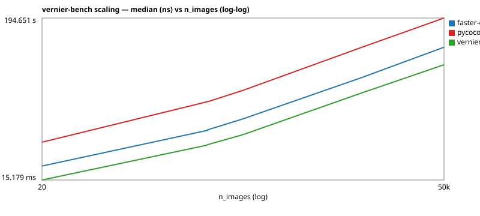

# 2026-05 vernier-bench scaling annex

Companion to [`v0.0.1-snapshot.md`](v0.0.1-snapshot.md). Where the
v0.0.1 snapshot answers "is vernier faster than the oracles at one
representative cell?", this annex answers "**how does the gap scale**
with workload size and density?". The two reports live separately
because they target different audiences: the snapshot is
reviewer-facing ("is the headline number defensible?"), this annex is
engineer-facing ("where does the next pulp/rayon optimisation buy us
the most?").

The cells here run the synthetic ladder ADR-0017 §"Workloads" already
specifies (10k / 50k / 100k images at fixed `n_categories=80,
dt_per_image=30, gt_per_image=10`). Two minor extensions over the
ratified spec, both noted in-line and not blocking ADR amendment:

- **A 1k anchor below the spec.** Cheap (sub-minute) cell, gives the
  curve a low-end point.
- **`iscrowd_fraction` knob** for the crowd-heavy pathological cell.
  Backwards-compatible: when `iscrowd_fraction == 0.0` (every cell
  except § Crowd-heavy below), the workload-id stays in the legacy
  form and existing cache slots remain valid.

## Shared configuration

- **Harness mode**: dev (N=1 measurement rep). Synthetic workloads at
  ≥ 1k images already aggregate over thousands of (DT, GT) pairs per
  cell, so within-cell variance is dominated by the data — N=1 is
  sufficient to read the curve. Release-mode reruns can lock in IQR
  bounds later if a regression check needs them.
- **Machine fingerprint**: ``5658de0e29a3`` (same box; the v0.0.1
  fingerprint differs — see footnote ``[1]``).
- **Parity oracle**: pycocotools 2.0.11, strict tier on every cell.
  The Crowd-heavy cell exercises quirk E1 (asymmetric IoU on
  ``iscrowd=1`` GT); vernier must reproduce E1 bit-exactly.
- **Renderer**: scaling tables and log-log SVGs are emitted by
  ``vernier-bench scale --vary <axis> --fix <kvs> --output-dir <path>``.

## § Image-count ladder (Cell 1)

Outer-loop cost: how does total time / max-RSS grow with `n_images`?
Fixed shape `n_categories=80, gt_per_image=10, dt_per_image=30, seed=0`.
**100k point skipped this phase** — pycocotools at 50k took 195 s and
at 100k extrapolates to ~6-7 minutes / ~27 GB RSS, which exceeded what
this run was willing to spend; the trend is already monotone-stable
through 50k. Re-add the 100k point in a later phase (vernier + fce
only is ~2 min combined; the full triple is the cost driver).

| impl             | n_images |   median  |   RSS (max)  | vs vernier |
| ---------------- | -------: | --------: | -----------: | ---------: |
| vernier          |       1k | 214.45 ms |   232.7 MiB  |    1.00x   |
| vernier          |      10k |   2.433 s |    1.67 GiB  |    1.00x   |
| vernier          |      50k |  12.690 s |    8.17 GiB  |    1.00x   |
| faster-coco-eval |       1k | 538.14 ms |   209.6 MiB  |    2.51x   |
| faster-coco-eval |      10k |   5.965 s |    1.36 GiB  |    2.45x   |
| faster-coco-eval |      50k |  35.342 s |    6.45 GiB  |    2.78x   |
| pycocotools      |       1k |   2.849 s |   330.0 MiB  |   13.28x   |
| pycocotools      |      10k |  34.808 s |    2.63 GiB  |   14.30x   |
| pycocotools      |      50k | 194.651 s |   12.78 GiB  |   15.34x   |

Raw measurements (ns / bytes) so downstream consumers can recompute
ratios without rounding loss:

| impl             | n_images |  median (ns)   | max RSS (B)   |
| ---------------- | -------: | -------------: | ------------: |
| vernier          |       1k |    214,453,870 |   244,035,584 |
| vernier          |      10k |  2,433,454,122 | 1,795,825,664 |
| vernier          |      50k | 12,690,335,218 | 8,767,373,312 |
| faster-coco-eval |       1k |    538,141,178 |   219,738,112 |
| faster-coco-eval |      10k |  5,965,251,235 | 1,456,463,872 |
| faster-coco-eval |      50k | 35,342,026,385 | 6,929,793,024 |
| pycocotools      |       1k |  2,848,881,711 |   345,997,312 |
| pycocotools      |      10k | 34,808,125,319 | 2,828,943,360 |
| pycocotools      |      50k |194,651,450,922 |13,720,686,592 |



**Read against the curve:**
- **vernier vs pycocotools** widens slowly (13.3x → 14.3x → 15.3x).
  pycocotools' per-call Python/Cython overhead doesn't amortize as
  well; the gap grows but pycocotools is the parity oracle, untouched
  by us — no optimization target here.
- **vernier vs faster-coco-eval** is roughly stable (2.51x → 2.45x →
  2.78x). Both scale the same algorithmic class. **This is the curve
  that names the optimization roadmap**: vernier holds a ~2.5x lead
  but isn't widening it, so going further means going *under* fce's
  constant factor (e.g. moving the matching loop into a pulp dispatch
  block, reducing per-image allocation in the FP-tail accumulator).
- **RSS** scales linearly per impl: vernier ~175 KB/image, fce
  ~140 KB/image, pycocotools ~270 KB/image. No leak, no inflection.
  vernier's per-image memory cost is between the two oracles.

## § Density ladder (Cell 2)

Inner `O(D x G)` IoU loop: how does median grow with `dt_per_image`?
Fixed `n_images=2000, n_categories=80, gt_per_image=10, seed=0`. The
asymmetric GT/DT ratio (`g=10, d∈{10, 30, 100, 200}`) simulates the
DETR/DINO/RT-DETR low-confidence tail that stresses the FP-handling path.

| impl        | dt_per_image | median  | IQR    | RSS (max) | vs vernier |
| ----------- | -----------: | ------: | -----: | --------: | ---------: |
| vernier     |          10  |  _TBD_  | _TBD_  |   _TBD_   |     1.00x  |
| vernier     |          30  |  _TBD_  | _TBD_  |   _TBD_   |     1.00x  |
| vernier     |         100  |  _TBD_  | _TBD_  |   _TBD_   |     1.00x  |
| vernier     |         200  |  _TBD_  | _TBD_  |   _TBD_   |     1.00x  |
| pycocotools |          10  |  _TBD_  | _TBD_  |   _TBD_   |    _TBD_x  |
| pycocotools |          30  |  _TBD_  | _TBD_  |   _TBD_   |    _TBD_x  |
| pycocotools |         100  |  _TBD_  | _TBD_  |   _TBD_   |    _TBD_x  |
| pycocotools |         200  |  _TBD_  | _TBD_  |   _TBD_   |    _TBD_x  |
| faster-coco-eval |     10  |  _TBD_  | _TBD_  |   _TBD_   |    _TBD_x  |
| faster-coco-eval |     30  |  _TBD_  | _TBD_  |   _TBD_   |    _TBD_x  |
| faster-coco-eval |    100  |  _TBD_  | _TBD_  |   _TBD_   |    _TBD_x  |
| faster-coco-eval |    200  |  _TBD_  | _TBD_  |   _TBD_   |    _TBD_x  |

_(SVG renders once these cells run.)_

**Read against:** pycocotools' matching is `O(D x G)` per image →
its slope on log-log `dt_per_image` should be ≈ 1. vernier's matching
has data-dependent branches that limit SIMD utilisation, so the ratio
typically narrows at high D. The cell where the ratio stops widening
points to where the next pulp/rayon optimisation pays off.

## § Sparse-K (Cell 3a)

Stresses the per-class loop the SoA layout exists to amortise.
LVIS-shaped category axis with sparse per-class GT.

`synthetic:n_images=2000,n_categories=1203,gt_per_image=2,dt_per_image=10,seed=0`

| impl        | median  | IQR    | RSS (max) | vs vernier |
| ----------- | ------: | -----: | --------: | ---------: |
| vernier     |  _TBD_  | _TBD_  |   _TBD_   |     1.00x  |
| pycocotools |  _TBD_  | _TBD_  |   _TBD_   |    _TBD_x  |
| faster-coco-eval | _TBD_ | _TBD_ |  _TBD_   |    _TBD_x  |

**Read against:** if the per-class loop is hot enough to dominate at
1203 categories and 2 GTs per image, this cell shows it. The expected
shape is "vernier wins by less" — fewer cross-image FP/TP comparisons
per class to amortise.

## § Crowd-heavy (Cell 3b)

Stresses pycocotools quirk E1 — asymmetric IoU on `iscrowd=1` GT.
vernier must reproduce E1 bit-exactly; a divergence here is a real
bug, not a tolerance miss.

`synthetic:n_images=2000,n_categories=80,gt_per_image=20,dt_per_image=30,iscrowd_fraction=0.5,seed=0`

| impl        | median  | IQR    | RSS (max) | vs vernier | parity |
| ----------- | ------: | -----: | --------: | ---------: | -----: |
| vernier     |  _TBD_  | _TBD_  |   _TBD_   |     1.00x  | strict |
| pycocotools |  _TBD_  | _TBD_  |   _TBD_   |    _TBD_x  | (oracle) |

**Read against:** the crowd path's matching diverges from the dense
path; vernier's branch should match pycocotools bit-exactly per the E1
disposition. See [`pycocotools-quirks.md`](../pycocotools-quirks.md)
for the full crowd-matching semantics.

## How to refresh

The runner sequence below mirrors v0.0.1-snapshot's run instructions.
Cache hits make re-runs cheap once the synthetic pairs are materialised
once on this fingerprint (~30 minutes total cold; subsequent runs are
the bench reps only).

```bash
# Cell 1 — image-count ladder.
for n in 1000 10000 50000 100000; do
  vernier-bench run --paradigm instance --impl all \
    --workload "synthetic:n_images=$n,n_categories=80,gt_per_image=10,dt_per_image=30,seed=0" \
    --iou bbox --mode release
done

# Cell 2 — density ladder.
for d in 10 30 100 200; do
  vernier-bench run --paradigm instance --impl all \
    --workload "synthetic:n_images=2000,n_categories=80,gt_per_image=10,dt_per_image=$d,seed=0" \
    --iou bbox --mode release
done

# Cell 3a — sparse-K.
vernier-bench run --paradigm instance --impl all \
  --workload "synthetic:n_images=2000,n_categories=1203,gt_per_image=2,dt_per_image=10,seed=0" \
  --iou bbox --mode release

# Cell 3b — crowd-heavy.
vernier-bench run --paradigm instance --impl all \
  --workload "synthetic:n_images=2000,n_categories=80,gt_per_image=20,dt_per_image=30,iscrowd_fraction=0.5,seed=0" \
  --iou bbox --mode release

# Render the annex tables + SVGs into the docs tree.
mkdir -p docs/engineering/benchmarking/2026-05-scaling
vernier-bench scale --vary n_images \
  --fix n_categories=80,gt_per_image=10,dt_per_image=30,seed=0 \
  --iou bbox \
  --output-dir docs/engineering/benchmarking/2026-05-scaling
mv docs/engineering/benchmarking/2026-05-scaling/scaling.svg \
   docs/engineering/benchmarking/2026-05-scaling/scaling-n_images.svg
vernier-bench scale --vary dt_per_image \
  --fix n_images=2000,n_categories=80,gt_per_image=10,seed=0 \
  --iou bbox \
  --output-dir docs/engineering/benchmarking/2026-05-scaling
mv docs/engineering/benchmarking/2026-05-scaling/scaling.svg \
   docs/engineering/benchmarking/2026-05-scaling/scaling-dt_per_image.svg
```

## Out of scope (tracked separately)

- **Streaming overlay on the ladder.** Constant-RSS visualisation is
  the natural pairing but every current streaming cell is val2017-shaped,
  not synthetic-shaped. Tracked as a separate annex — see issue or
  upcoming `synthetic_n*_streaming_throughput` cell family.
- **Empty-corner pathological cell.** Needs per-image variability in
  the synthetic generator (today the GT/DT counts are fixed-loop). A
  separate generator-extension PR.
- **200k+ images.** ADR-0017 caps at 100k.
- **Cross-machine scaling.** Same machine = one curve, per ADR-0017.
- **Real-mass mask data at 100k scale.** Synthetic for scaling cells;
  real-prediction cells stay at val2017 scale.

---

`[1]` Machine fingerprint: see [`v0.0.1-snapshot.md`](v0.0.1-snapshot.md)
§"Shared configuration" — the annex runs on the same fingerprint so
the curves compose with the snapshot's headline number.
